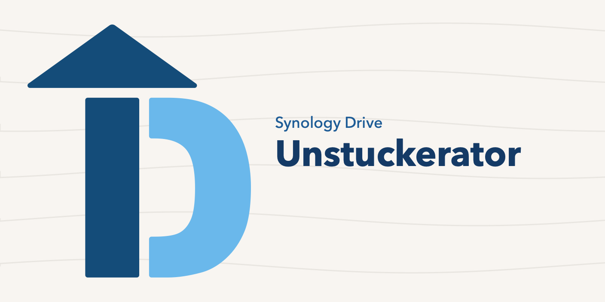

# Synology Drive Unstuckerator



Synology Drive Unstuckerator is a menu-bar utility for macOS. It watches folders you choose inside Synology Drive, records permanent File Provider upload failures, and can publish one verified retry copy of a file that Synology has stopped uploading.

The name, mark, and colors are in [docs/brand.md](docs/brand.md).

This project is not affiliated with Synology Inc. Synology, Synology Drive, and related marks belong to their owners.

## What it does

Synology Drive's File Provider sometimes leaves a file in a permanent upload failure (`NSFileProviderErrorDomain`, code `-2005`). The file is on disk and marked downloaded, but Drive does not finish the upload. Finder's Retry is not one of the documented reset conditions.

Synology Drive Unstuckerator:

1. Walks each watched folder, including nested folders, and asks `fileproviderctl evaluate` about eligible files that changed recently.
2. Treats a file as needing attention only after two matching checks at least 60 seconds apart. A single `isUploading` flag is not treated as a failure.
3. Lets you press **Fix** on that file. Fix tries a same-volume clone (APFS copy-on-write), falling back to a full copy only when the disk-space plan allows it, compares the SHA-256 of the source and the staged copy, and publishes one sibling next to the original.
4. Waits until Synology reports that sibling uploaded and the upload error is gone.
5. Revalidates both file versions and their SHA-256 digests before archiving the original and moving the verified sibling to the original name. Local placement and final-name upload acknowledgment are separate stages. The original remains retained until the final filename also reports uploaded. If Synology reports the final filename itself failed to upload, the file returns to **Attention** with **Check Final Name** and **Undo**; no further copy is made. **Check Upload** resumes the recorded sibling; changed files and interrupted filesystem operations go to **Recovery**.
6. Offers **Undo** for 6 hours after final-name upload acknowledgment, while the replacement remains unchanged. Undo refuses to displace a newer edit. Interrupted operations, legacy archives, and parked recovery copies stay outside automatic expiry; Activity → Retained Files shows them and offers Reveal in Finder and Export Copy. After Undo, the restored original is checked again like any other file.

Nothing is removed before Synology reports the replacement uploaded. The original is not overwritten in place.

Monitoring is automatic. **Fix** stays visible while a file is being checked, with an explanation when unavailable. Other upload errors Synology reports, such as being offline or the NAS being full, are shown on the file but are never repaired. Growing exports update one observation instead of producing duplicate queue rows. The default stability wait is five minutes after the last write.

**Settings → Folders → Auto-fix new failures** opts in to repairing new failures one at a time after baseline review, the stability wait, and two confirmations at least 60 seconds apart. Auto-fix is off by default; existing baseline failures still require **Fix**. Auto-fix also skips any file last modified before the folder's setup review, and any file version that already had a repair operation, even under another name; those need **Fix**. Pause or disabling auto-fix blocks unpublished repairs; already published copies continue verification. A stopped automatic attempt requires manual review instead of repeatedly retrying. After launch, auto-fix waits until a scan finishes, so it never acts on saved results alone.

## Requirements

- macOS 15 or later. Native controls adapt to system appearance and accessibility settings.
- The Synology Drive client, with the folder available as a File Provider volume under `~/Library/CloudStorage`.
- Swift 6.2 or later and a macOS SDK supporting macOS 15 to build from source.

The app is a menu-bar item. It is not sandboxed and it is not distributed through the App Store. It does not phone home.

## Download

The current build is on the [releases page](https://github.com/michaelsantos00/synology-drive-unstuckerator/releases). It is an Apple silicon app for macOS 15 or later, ad-hoc signed, and not notarized.

1. Download the macOS zip from the releases page and open it.
2. Move `Synology Drive Unstuckerator.app` to your Applications folder.
3. The first time you open it, macOS blocks it because this build is ad-hoc signed and not notarized. Allow it once: open **System Settings > Privacy & Security**, scroll to the Security section, click **Open Anyway**, then confirm with **Open**. The older Control-click > Open shortcut no longer works on macOS 15 and later.

## Build and run the tests

```bash
swift test
```

If your checkout lives inside a synced folder (for example Synology Drive), the file attributes it adds break code signing of the build products. Build outside it:

```bash
swift test --scratch-path /private/tmp/unstuckerator-build
```

## Build a local app

```bash
scripts/package-app.sh
```

That builds a release binary, assembles `Synology Drive Unstuckerator.app` in `~/Applications`, ad-hoc signs it, and opens it. Pass another destination if you want the bundle somewhere else:

```bash
scripts/package-app.sh "$HOME/Desktop/Synology Drive Unstuckerator.app"
```

The first open after signing sometimes fails with a launch-services error. The script opens the app a second time.

Quit the menu-bar app from the **More** (…) menu → **Quit**, or with:

```bash
osascript -e 'tell application "Synology Drive Unstuckerator" to quit'
```

Do not signal `fileproviderd`, `cloud-drive-eventd`, or any other Synology process. Those are not part of this app.

## Using it

1. The first time you open the app, a **Welcome** window explains where it lives and asks for a folder. **Choose Folder…** opens in your Synology Drive folder; folders outside `~/Library/CloudStorage` are refused, because Synology Drive does not upload them. Video files are checked by default. Opening the app again while it runs shows **Activity** (or **Welcome** if no folder is chosen yet).
2. To add more folders, open **Settings → Folders** and click **+**, or drag a folder onto the list. Existing folders and their rules are preserved. Nested folders are included automatically; duplicate and overlapping selections are rejected. **−** stops watching the selected folder while keeping its files and recovery history; add a replacement before removing the last folder.
3. Choose which kinds of files to inspect for each folder (video, archives, PDF, and any extra extensions), and how long a file must stop changing before it is checked. Names containing `_segment_` stay ignored.
4. Press **Apply Rules**. Monitoring and auto-fix choices save immediately; file types and rules show an unapplied indicator until applied. Switching folders offers to discard unapplied edits.
5. Click the menu-bar icon. The menu shows the state, a small badge on the icon when monitoring is paused or a folder cannot be read, and up to three files from **Attention**, **Checking**, **Repairing**, or **Recent**. **Scan Now** discovers eligible files modified in the last 7 days and rechecks older known failures. Files younger than the stability wait are listed and checked again later. They are not dropped silently.
6. **Fix** runs only for the file on that row. **Undo** restores an original that is still inside the 6-hour window. Click a file to open it in **Activity**.
7. **Activity** lists files by queue (Needs Attention, Checking, Repairing, Recent), retained files for recovery, and history (All Activity, Found at Setup, Earlier Versions, Ignored, Errors). Select a file to see what happened, what happens next, its copies, and its history in the inspector. Right-click a file for **Reveal in Finder**, **Copy Diagnostic**, **Ignore This Version**, and **Mark as Resolved**. Search filters the current list.
8. **More (…) → Clear Unprotected History…** clears local findings and activity. Active repairs, operation records, Undo access, ignored files, and files found at setup are kept.

Use **Settings → General** for opening at login, notifications, monitoring, auto-fix, and the disk warning threshold. macOS may ask you to approve the login item. Clicking a notification opens that file in Activity. Use **Diagnostics** for privacy, report export, and a shortcut to the app's data folder.

## Where data lives

All of this is outside the synced folder:

| Path | Contents |
| --- | --- |
| `~/Library/Application Support/Synology Drive Unstuckerator/Store` | Local finding history |
| `~/Library/Application Support/Synology Drive Unstuckerator/Staging` | Copies being prepared for publication |
| `~/Library/Application Support/Synology Drive Unstuckerator/Undo` | Verified originals with a 6-hour Undo window; unresolved recovery copies retained until reviewed |
| `~/Library/Application Support/Synology Drive Unstuckerator/Journals` | Durable JSON operation records, plus per-path process locks |

Activity keeps routine scan entries for 7 days and other entries for 180 days. Operation records and retained files are not affected by that limit.

The first launch under this name moves a folder left behind by an earlier name, `Unstuckerator` or `Synology Drive Monitor`, if that folder is still there. Removing the app does not remove the folder. Delete `~/Library/Application Support/Synology Drive Unstuckerator` yourself when you want the history and the undo cache gone. Do that only after you no longer need Undo.

## Safety limits

- The tool only runs `/usr/bin/fileproviderctl evaluate`. It does not run `fileproviderctl repair`.
- Exit code 0 from `evaluate` is not treated as "healthy". The parser requires one complete `fileproviderItems` dictionary and fails closed on output it does not understand.
- A fix refuses to publish on insufficient free space. When the same-volume clone check passes, the required headroom is the configured reserve (20 GiB by default, floored at 1 GiB), because a clone does not need a second full copy of the bytes. Otherwise it requires at least the greater of twice the file size and the file size plus reserve. Cross-volume staging is blocked.
- The source and the staged copy are both SHA-256 hashed and compared before publication. This is not a checksum of the file on the NAS. A hash mismatch or a failed move stops the attempt and leaves the staged file in place for inspection; a cross-volume stage is blocked before staging begins.
- This repository must not be added as a watched root. It is source code, not a Drive library.

The current hardening work, migration behavior, and remaining acceptance checks are in [docs/hardening.md](docs/hardening.md).

More detail is in [docs/safety.md](docs/safety.md) and [docs/architecture.md](docs/architecture.md).

## License

Source is published under the [PolyForm Noncommercial License 1.0.0](LICENSE.md). That is a **source-available** license, not an OSI-approved open source license, because it does not permit commercial use.

You may use, study, modify, and share this software for noncommercial purposes, including personal use, research, hobby projects, and use by schools, charities, public research organizations, and government institutions.

You may not use it for commercial gain. That includes selling it, hosting it as a paid service, or bundling it into a product you charge for. There is no separate commercial license.

Required Notice: Copyright Michael Santos (https://github.com/digitalinksol)

## Contributing

See [CONTRIBUTING.md](CONTRIBUTING.md).
